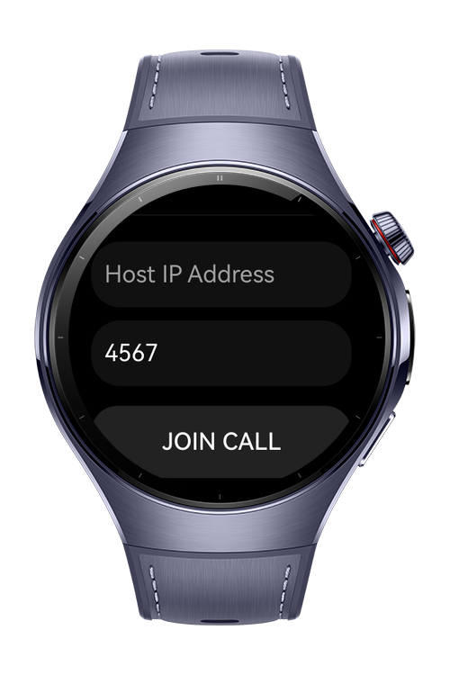
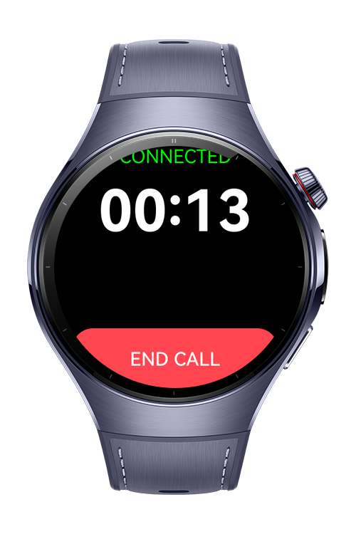

> **Note:** To access all shared projects, get information about environment setup, and view other guides, please visit [Explore-In-HMOS-Wearable Index](https://github.com/Explore-In-HMOS-Wearable/hmos-index).

# P2P Voice Call Application

This project is a peer-to-peer (P2P) voice intercom designed for HarmonyOS wearables, enabling real-time audio communication directly between two watches over a local Wi-Fi network. It features a custom UDP/TCP socket architecture with an automated "port-hunter" logic to bypass connection conflicts and handle dynamic IP addressing seamlessly. By utilizing the AudioKit's voice communication mode, the app provides hardware-level noise suppression and echo cancellation for clear, low-latency walkie-talkie functionality.# Preview

# Preview

<div>    
  
  
  
</div> 

# Use Cases

A real-time voice communication system for HarmonyOS wearables that establishes direct watch-to-watch links over local Wi-Fi without requiring a central server.

# Technology
## Stack
  - **Languages**: ArkTS, ARKUI
  - **Frameworks**: HarmonyOS SDK 5.1.0(18)
  - **Tools**: DevEco Studio Vers 6.0.1
  - **Libraries**: 
      - @kit.ArkUI 
      - @kit.BackgroundTasksKit 
      - @kit.AbilityKit 
## Required Permissions
  - `ohos.permission.INTERNET`
  - `ohos.permission.GET_NETWORK_INFO`
  - `ohos.permission.GET_WIFI_INFO`
  - `ohos.permission.VIBRATE`
  - `ohos.permission.MICROPHONE`
      

# Directory Structure

````
├───AppScope
│   └───resources
│       └───base
│           ├───element
│           └───media
├───entry
│   └───src
│       ├───main
│       │   ├───ets
│       │   │   ├───pages 
│       │   │   │   ├───Index
│       │   └───resources
│       │       ├───base
│       │       │   ├───element
│       │       │   ├───media
│       │       │   └───profile
````

# Constraints and Restrictions
## Suported Devices

- Huawei Watch 5

# LICENSE

P2pVoiceCall is distributed under the terms of the MIT License.
See the [LICENSE](/LICENSE) for more information.

